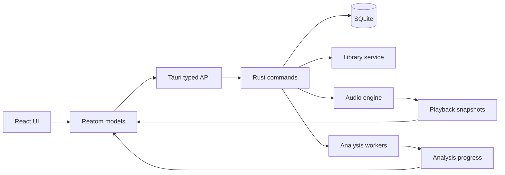
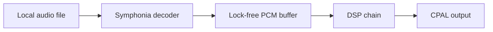

# Codex Prompt: MVP локального музыкального плеера и анализатора

## Контекст

Ты работаешь в уже существующем проекте **Tauri + React + TypeScript**, который базово создан и запускается. Не создавай новый проект, не переписывай репозиторий с нуля и не заменяй существующую конфигурацию шаблоном.

Твоя задача — исследовать текущий проект, добавить необходимые зависимости и собрать рабочий MVP local-first музыкального приложения.

Приложение должно работать с локальными музыкальными файлами пользователя. Файлы остаются на своих местах в файловой системе. Приложение хранит ссылки на них, метаданные, плейлисты, очередь, настройки, историю прослушивания и результаты анализа.

---

# 1. Сначала проведи аудит проекта

Перед изменениями:

1. Определи package manager по lock-файлу.
2. Изучи:
   - `package.json`;
   - `vite.config.*`;
   - `tsconfig*`;
   - ESLint/Prettier;
   - текущую структуру `src`;
   - `src-tauri/Cargo.toml`;
   - `src-tauri/src/lib.rs`;
   - `src-tauri/src/main.rs`;
   - `src-tauri/tauri.conf.json`;
   - текущие Tauri capabilities и permissions.
3. Определи текущие версии:
   - Tauri;
   - React;
   - TypeScript;
   - Reatom;
   - Rust edition;
   - Vite.
4. Проверь:
   - существующие alias;
   - роутер;
   - UI-библиотеки;
   - CSS-стек;
   - структуру Reatom;
   - существующие команды Tauri;
   - уже подключённые плагины.

После аудита не останавливайся на плане. Сразу переходи к реализации.

Не задавай пользователю вопросы, если ответ можно получить из проекта или принять разумное инженерное решение.

---

# 2. Неподлежащие обсуждению ограничения

## Frontend

Обязательно использовать:

- React;
- TypeScript strict;
- Reatom как единственный state manager;
- Feature-Sliced Design;
- shadcn/ui поверх Radix UI;
- Tauri commands/events/channels;
- Canvas 2D для waveform и peak map.

Запрещено:

- Redux;
- Zustand;
- MobX;
- Jotai;
- XState;
- Ant Design;
- MUI;
- Chakra;
- Mantine;
- Bootstrap;
- browser `<audio>` как основной аудиодвижок;
- Web Audio API как основной аудиодвижок;
- прямой SQL из React;
- хранение библиотеки в localStorage;
- хранение PCM или waveform в localStorage.

React Context разрешён только для технических provider-ов: router, theme и provider-ов сторонних библиотек. Бизнес-состояние в Context не хранить.

---

# 3. Feature-Sliced Design

Строго ориентируйся на официальную документацию:

- https://fsd.how/ru/docs/get-started/overview/
- https://fsd.how/docs/reference/layers/
- https://fsd.how/docs/reference/public-api/

Используй слои:

```text
src/
├── app/
├── pages/
├── widgets/
├── features/
├── entities/
└── shared/
```

Слой `processes` не использовать.

Правила:

- слой может импортировать только нижележащие слои;
- `shared` не импортирует верхние;
- между slices использовать публичный API через `index.ts`;
- deep imports в чужой slice запрещены;
- не создавать корневые `components`, `store`, `services`, `hooks`, `utils`;
- сегменты называть по назначению: `ui`, `model`, `api`, `lib`, `config`;
- общий UI хранить в `shared/ui`;
- общую IPC-инфраструктуру хранить в `shared/api/tauri`;
- бизнес-типы хранить внутри соответствующих entities;
- `shared` не превращать в свалку.

Настрой alias `@/* -> src/*`, если его ещё нет.

Добавь архитектурную проверку через Steiger, если актуальная версия совместима с проектом. Добавь script `lint:fsd`.

---

# 4. Reatom

Reatom — единственный state manager.

Сначала определи, какая версия Reatom уже используется, и придерживайся API именно этой версии. Не смешивай синтаксис разных поколений Reatom.

Предпочтительные правила:

- маленькие предметные атомы;
- derived state вместо дублирования;
- действия пользователя оформлять actions;
- async IPC оборачивать в model/api соответствующего slice;
- `invoke` не вызывать прямо из UI-компонентов;
- loading/error state хранить рядом с соответствующей операцией;
- не создавать один гигантский `appAtom`;
- не хранить весь backend-state в одном атоме;
- не хранить PCM;
- не обновлять всё приложение 60 раз в секунду из-за position;
- локализовать частые playback updates в player widgets;
- использовать `reatomComponent`, `ctx.spy`, `ctx.schedule` и async primitives текущей версии проекта.

---

# 5. UI-стек

Использовать **shadcn/ui поверх Radix UI**.

Добавить только реально используемые компоненты:

```text
button
input
scroll-area
separator
tooltip
dropdown-menu
context-menu
dialog
alert-dialog
sheet
popover
command
slider
tabs
badge
skeleton
progress
sonner
select
checkbox
table
```

Разрешены:

- Tailwind CSS;
- CSS variables;
- CSS Modules для Canvas и сложных layout-компонентов;
- lucide-react;
- clsx;
- tailwind-merge;
- class-variance-authority.

UI должен выглядеть как desktop media application, а не как админка и не как буквальный клон Spotify.

---

# 6. Цель MVP

Обязательно реализовать:

1. Импорт отдельных аудиофайлов.
2. Импорт директорий.
3. Сохранение библиотеки между запусками.
4. Хранение абсолютных путей к исходным файлам.
5. Проверку отсутствующих файлов.
6. Плейлисты.
7. Закреплённые плейлисты.
8. Добавление и удаление треков из плейлистов.
9. Изменение порядка треков.
10. Избранное.
11. Недавно добавленные треки.
12. Недавно прослушанные треки.
13. Очередь воспроизведения.
14. Реальное воспроизведение.
15. Play/pause/stop.
16. Seek.
17. Volume.
18. Next/previous.
19. Repeat.
20. Shuffle.
21. Persistent player bar.
22. Waveform.
23. Peak map.
24. Фоновый анализ.
25. Подготовку и желательно реализацию базового эквалайзера.
26. Сохранение настроек и playback session.

---

# 7. Зависимости frontend

Добавь только отсутствующие зависимости, используя совместимые актуальные версии:

```text
@reatom/... согласно текущему проекту
@tauri-apps/api
@tauri-apps/plugin-dialog
@tauri-apps/plugin-opener
@tauri-apps/plugin-store
@tauri-apps/plugin-window-state
@tanstack/react-router
lucide-react
clsx
tailwind-merge
class-variance-authority
zod
```

Если роутер уже есть, не заменяй его без причины.

Настрой shadcn/ui для текущего Vite-проекта, не создавая новый app.

---

# 8. Зависимости Rust

Подбери актуальные совместимые версии:

```text
serde
serde_json
thiserror
uuid
chrono или time
tokio
sqlx с SQLite
walkdir
symphonia
cpal
ringbuf
rubato
realfft
lofty
blake3
tracing
tracing-subscriber
crossbeam-channel
biquad
```

Опционально:

```text
ebur128
dasp
parking_lot
```

Добавляй их только при реальном использовании.

Предпочтительная аудиоархитектура:

```text
Symphonia decoder
    ↓
decoder worker
    ↓
lock-free PCM ring buffer
    ↓
DSP chain
    ↓
CPAL output callback
```

Не использовать `rodio` как фундамент, если это мешает DSP и точному управлению pipeline.

---

# 9. Frontend-структура

Целевая структура:

```text
src/
├── app/
│   ├── providers/
│   │   ├── router/
│   │   ├── reatom/
│   │   └── theme/
│   ├── routes/
│   ├── styles/
│   ├── App.tsx
│   └── index.ts
├── pages/
│   ├── home/
│   ├── library/
│   ├── playlist/
│   ├── track/
│   ├── analysis/
│   └── settings/
├── widgets/
│   ├── app-shell/
│   ├── sidebar/
│   ├── player-bar/
│   ├── playback-queue/
│   ├── track-list/
│   ├── playlist-header/
│   ├── waveform-viewer/
│   ├── peak-map/
│   └── track-analysis-panel/
├── features/
│   ├── import-music/
│   ├── create-playlist/
│   ├── edit-playlist/
│   ├── add-track-to-playlist/
│   ├── reorder-playlist-tracks/
│   ├── toggle-track-favorite/
│   ├── pin-playlist/
│   ├── control-playback/
│   ├── manage-playback-queue/
│   ├── edit-equalizer/
│   ├── start-track-analysis/
│   └── reveal-track-in-folder/
├── entities/
│   ├── track/
│   ├── playlist/
│   ├── playback/
│   ├── playback-queue/
│   ├── track-analysis/
│   └── equalizer/
└── shared/
    ├── api/
    │   └── tauri/
    ├── config/
    ├── lib/
    ├── model/
    ├── types/
    └── ui/
```

Не создавай все папки механически, если они пока не нужны. Но соблюдай модель.

---

# 10. Rust-структура

```text
src-tauri/src/
├── lib.rs
├── main.rs
├── state.rs
├── error.rs
├── dto/
├── commands/
│   ├── library.rs
│   ├── playlists.rs
│   ├── playback.rs
│   ├── queue.rs
│   ├── analysis.rs
│   └── settings.rs
├── database/
│   ├── connection.rs
│   ├── migrations.rs
│   └── repositories/
├── library/
│   ├── scanner.rs
│   ├── metadata.rs
│   ├── file_identity.rs
│   └── missing_files.rs
├── audio/
│   ├── engine.rs
│   ├── command.rs
│   ├── state.rs
│   ├── decoder.rs
│   ├── output.rs
│   ├── buffer.rs
│   └── dsp/
│       ├── chain.rs
│       ├── equalizer.rs
│       ├── biquad.rs
│       └── limiter.rs
├── analysis/
│   ├── worker.rs
│   ├── queue.rs
│   ├── waveform.rs
│   ├── peaks.rs
│   ├── spectrum.rs
│   └── cache.rs
└── settings/
```

`AppState` должен владеть:

- SQLite pool;
- `Arc<AudioEngine>`;
- analysis service/queue;
- settings service.

---

# 11. Локальное хранилище

Использовать Tauri app data directory.

```text
<AppData>/<app-id>/
├── library.sqlite
├── preferences.json
├── logs/
└── cache/
    ├── covers/
    ├── waveforms/
    ├── peaks/
    ├── spectrograms/
    └── analysis/
```

Музыкальные файлы не копировать.

Использовать SQLx migrations.

## Таблица library_roots

```sql
CREATE TABLE library_roots (
    id TEXT PRIMARY KEY NOT NULL,
    path TEXT NOT NULL UNIQUE,
    recursive INTEGER NOT NULL DEFAULT 1,
    enabled INTEGER NOT NULL DEFAULT 1,
    created_at INTEGER NOT NULL,
    last_scan_at INTEGER
);
```

## Таблица tracks

```sql
CREATE TABLE tracks (
    id TEXT PRIMARY KEY NOT NULL,
    file_path TEXT NOT NULL UNIQUE,
    file_name TEXT NOT NULL,
    file_size INTEGER NOT NULL,
    modified_at INTEGER NOT NULL,
    content_fingerprint TEXT,

    title TEXT,
    artist TEXT,
    album TEXT,
    album_artist TEXT,
    genre TEXT,
    year INTEGER,
    track_number INTEGER,
    disc_number INTEGER,

    duration_ms INTEGER NOT NULL,
    sample_rate INTEGER,
    channels INTEGER,
    bit_depth INTEGER,
    codec TEXT,
    bitrate INTEGER,

    cover_cache_key TEXT,

    added_at INTEGER NOT NULL,
    updated_at INTEGER NOT NULL,
    last_played_at INTEGER,
    play_count INTEGER NOT NULL DEFAULT 0,
    is_favorite INTEGER NOT NULL DEFAULT 0,
    is_missing INTEGER NOT NULL DEFAULT 0
);
```

## Таблица playlists

```sql
CREATE TABLE playlists (
    id TEXT PRIMARY KEY NOT NULL,
    name TEXT NOT NULL,
    description TEXT,
    cover_path TEXT,
    is_pinned INTEGER NOT NULL DEFAULT 0,
    created_at INTEGER NOT NULL,
    updated_at INTEGER NOT NULL
);
```

## Таблица playlist_tracks

Разрешить повтор одного трека в плейлисте:

```sql
CREATE TABLE playlist_tracks (
    id TEXT PRIMARY KEY NOT NULL,
    playlist_id TEXT NOT NULL,
    track_id TEXT NOT NULL,
    position INTEGER NOT NULL,
    added_at INTEGER NOT NULL,

    FOREIGN KEY (playlist_id)
        REFERENCES playlists(id)
        ON DELETE CASCADE,

    FOREIGN KEY (track_id)
        REFERENCES tracks(id)
        ON DELETE CASCADE
);
```

Добавить индексы и транзакционный reorder.

## История

```sql
CREATE TABLE playback_history (
    id INTEGER PRIMARY KEY AUTOINCREMENT,
    track_id TEXT NOT NULL,
    started_at INTEGER NOT NULL,
    listened_ms INTEGER NOT NULL DEFAULT 0,
    completed INTEGER NOT NULL DEFAULT 0,

    FOREIGN KEY (track_id)
        REFERENCES tracks(id)
        ON DELETE CASCADE
);
```

## Анализ

```sql
CREATE TABLE track_analysis (
    track_id TEXT PRIMARY KEY NOT NULL,
    analysis_version INTEGER NOT NULL,
    source_modified_at INTEGER NOT NULL,
    status TEXT NOT NULL DEFAULT 'pending',
    progress REAL NOT NULL DEFAULT 0,

    waveform_path TEXT,
    peaks_path TEXT,
    spectrogram_path TEXT,
    diagnostics_path TEXT,

    integrated_lufs REAL,
    true_peak_db REAL,
    dynamic_range_db REAL,

    analyzed_at INTEGER,
    error TEXT,

    FOREIGN KEY (track_id)
        REFERENCES tracks(id)
        ON DELETE CASCADE
);
```

## EQ

```sql
CREATE TABLE equalizer_presets (
    id TEXT PRIMARY KEY NOT NULL,
    name TEXT NOT NULL,
    is_builtin INTEGER NOT NULL DEFAULT 0,
    bands_json TEXT NOT NULL,
    preamp_db REAL NOT NULL DEFAULT 0,
    created_at INTEGER NOT NULL,
    updated_at INTEGER NOT NULL
);
```

```sql
CREATE TABLE track_equalizer_settings (
    track_id TEXT PRIMARY KEY NOT NULL,
    preset_id TEXT,
    override_json TEXT,
    enabled INTEGER NOT NULL DEFAULT 1,
    updated_at INTEGER NOT NULL,

    FOREIGN KEY (track_id)
        REFERENCES tracks(id)
        ON DELETE CASCADE,

    FOREIGN KEY (preset_id)
        REFERENCES equalizer_presets(id)
        ON DELETE SET NULL
);
```

## Настройки

```sql
CREATE TABLE settings (
    key TEXT PRIMARY KEY NOT NULL,
    value_json TEXT NOT NULL,
    updated_at INTEGER NOT NULL
);
```

---

# 12. Идентификация файлов

При импорте сохранять:

- canonical path;
- size;
- modified time;
- fingerprint.

Для MVP fingerprint можно считать BLAKE3 от:

- размера;
- первых N KiB;
- последних N KiB;
- опционально фрагмента середины.

Не блокировать импорт полным hash больших файлов.

При старте:

- быстро загрузить записи из SQLite;
- не выполнять полный scan до показа UI;
- в фоне проверить существование файлов;
- обновлять `is_missing`;
- отправлять изменения батчами.

Если файл отсутствует:

- вернуть типизированную ошибку;
- пометить track missing;
- показать понятное уведомление;
- позволить найти файл заново или удалить запись.

---

# 13. IPC

Создай единый typed wrapper в `shared/api/tauri`.

Не разбрасывай строки commands по UI.

Команды:

```text
library_get_tracks
library_get_track
library_import_files
library_import_directory
library_get_roots
library_remove_root
library_rescan
library_check_missing

playlist_get_all
playlist_get_by_id
playlist_create
playlist_update
playlist_delete
playlist_add_tracks
playlist_remove_items
playlist_reorder_items
playlist_set_pinned

playback_load
playback_play
playback_pause
playback_stop
playback_seek
playback_set_volume
playback_set_repeat
playback_set_shuffle
playback_get_snapshot

queue_get
queue_replace
queue_append
queue_insert_next
queue_remove
queue_reorder
queue_clear

analysis_start
analysis_cancel
analysis_get_status
analysis_get_waveform
analysis_get_peak_map

equalizer_get_presets
equalizer_save_preset
equalizer_delete_preset
equalizer_apply_preset
equalizer_set_track_override

settings_get
settings_set
settings_get_all
```

Единый формат ошибки:

```ts
type AppErrorDto = {
    code:
        | 'NOT_FOUND'
        | 'FILE_MISSING'
        | 'UNSUPPORTED_FORMAT'
        | 'DATABASE_ERROR'
        | 'AUDIO_DEVICE_ERROR'
        | 'PLAYBACK_ERROR'
        | 'ANALYSIS_ERROR'
        | 'VALIDATION_ERROR'
        | 'UNKNOWN';
    message: string;
    details?: Record<string, unknown>;
};
```

---

# 14. Аудиодвижок

## Требования

Реализовать:

- load;
- play;
- pause;
- stop;
- seek;
- volume;
- next;
- previous;
- duration;
- position;
- обработку конца трека;
- корректное завершение stream;
- архитектуру выбора output device.

Минимальные форматы:

- MP3;
- FLAC;
- WAV.

## Потоки

Разделить:

1. control thread;
2. decoder worker;
3. CPAL callback;
4. offline analysis workers;
5. async database tasks.

В real-time callback запрещены:

- SQL;
- filesystem;
- JSON;
- Tauri emit;
- тяжёлая FFT;
- блокирующие mutex;
- аллокации;
- логирование на каждый callback.

PCM передавать через lock-free ring buffer.

Пример команд:

```rust
pub enum AudioCommand {
    Load {
        track_id: String,
        path: PathBuf,
    },
    Play,
    Pause,
    Stop,
    Seek {
        position_ms: u64,
    },
    SetVolume {
        linear: f32,
    },
    SetEqualizer {
        config: EqualizerConfig,
    },
    Shutdown,
}
```

Snapshot:

```rust
pub struct PlaybackSnapshot {
    pub track_id: Option<String>,
    pub status: PlaybackStatus,
    pub position_ms: u64,
    pub duration_ms: u64,
    pub volume: f32,
    pub buffered_ms: u64,
    pub error: Option<String>,
}
```

Отправлять snapshot примерно 10–20 раз в секунду. Не делать emit на каждый sample.

---

# 15. Очередь

Очередь не равна плейлисту.

```ts
type QueueSource =
    | { type: 'playlist'; playlistId: string }
    | { type: 'library' }
    | { type: 'favorites' }
    | { type: 'recent' }
    | { type: 'manual' };

type PlaybackQueue = {
    source: QueueSource | null;
    itemIds: string[];
    currentIndex: number;
    history: string[];
};
```

При запуске из плейлиста создавать snapshot текущего порядка.

Repeat:

```text
off
all
one
```

Shuffle должен сохранять историю для корректной кнопки Previous.

---

# 16. Эквалайзер

Для MVP сделать 10-band EQ:

```text
31 Hz
62 Hz
125 Hz
250 Hz
500 Hz
1 kHz
2 kHz
4 kHz
8 kHz
16 kHz
```

Диапазон:

```text
-12 dB ... +12 dB
```

Функции:

- enable/disable;
- preamp;
- reset;
- built-in presets;
- пользовательские presets;
- per-track override;
- безопасное обновление DSP;
- smoothing параметров;
- корректный пересчёт коэффициентов при sample-rate change.

Не делать FFT convolution EQ.

---

# 17. Offline-анализ

Анализ отделить от playback.

При импорте:

1. быстро прочитать metadata;
2. сохранить трек;
3. показать его в UI;
4. поставить job в очередь;
5. отправлять progress;
6. сохранить cache;
7. обновить status.

## Waveform

Считать min/max buckets и несколько уровней детализации:

```text
level 0: ~5 ms
level 1: ~20 ms
level 2: ~100 ms
level 3: ~500 ms
```

Пример точки:

```rust
struct WaveformPoint {
    min: f32,
    max: f32,
}
```

Endpoint должен принимать диапазон и уровень детализации.

## Peak map

Считать:

- peak amplitude;
- peak dBFS;
- RMS;
- crest factor;
- clipping samples.

```rust
struct PeakFrame {
    time_ms: u32,
    peak_db: f32,
    rms_db: f32,
    crest_factor_db: f32,
    clipping_samples: u32,
}
```

## Шумные участки

Не делать одну псевдонаучную метрику noise.

Подготовить диагностические признаки:

- high-frequency energy ratio;
- spectral flatness;
- RMS;
- crest factor;
- clipping;
- DC offset;
- zero-crossing rate.

Marker:

```ts
type DiagnosticMarker = {
    type: string;
    startMs: number;
    endMs: number;
    severity: 'info' | 'warning' | 'critical';
    value: number;
    threshold: number;
    explanation: string;
};
```

Ввести `ANALYSIS_VERSION`.

Кэш устарел, если:

- изменился файл;
- изменилась версия анализа;
- cache отсутствует;
- header повреждён.

---

# 18. UI/UX

## Layout

```text
┌────────────────┬────────────────────────────────────────────┐
│ Sidebar        │ Main content                               │
│ Home           │                                            │
│ Library        │                                            │
│ Favorites      │                                            │
│ Recent         │                                            │
│ Playlists      │                                            │
│ Library roots  │                                            │
├────────────────┴────────────────────────────────────────────┤
│ Persistent Player Bar                                      │
└─────────────────────────────────────────────────────────────┘
```

## Routes

```text
/
 /library
 /favorites
 /recent
 /playlist/$playlistId
 /track/$trackId
 /track/$trackId/analysis
 /settings
```

## Home

- continue listening;
- pinned playlists;
- recently added;
- recently played;
- favorites;
- empty state;
- CTA «Добавить музыку».

## Library

- список треков;
- search;
- sort;
- play;
- context menu;
- add to playlist;
- favorite;
- reveal in folder;
- remove from library;
- missing state.

## Playlist

- header;
- play all;
- shuffle;
- rename;
- pin;
- delete;
- reorder;
- add/remove tracks;
- общая продолжительность.

## Track

- cover;
- title;
- artist;
- album;
- metadata;
- play;
- favorite;
- add to playlist;
- reveal in folder;
- waveform preview;
- analysis summary;
- shortcut к EQ.

## Analysis

Tabs:

```text
Overview
Waveform
Peak map
Equalizer
Diagnostics
Metadata
```

## Player bar

- cover;
- title;
- artist;
- previous;
- play/pause;
- next;
- shuffle;
- repeat;
- seek;
- current time;
- duration;
- volume;
- queue;
- analysis link.

## Queue panel

- current;
- next up;
- history;
- drag reorder;
- remove;
- play next;
- clear;
- source label.

---

# 19. Reatom-модели

## Library

```text
tracksAtom
tracksQueryAtom
selectedTrackIdsAtom
libraryRootsAtom
missingTracksCountAtom
loadTracksAction
importFilesAction
importDirectoryAction
rescanLibraryAction
toggleFavoriteAction
```

## Playlists

```text
playlistsAtom
pinnedPlaylistsAtom
activePlaylistIdAtom
activePlaylistAtom
createPlaylistAction
renamePlaylistAction
deletePlaylistAction
addTracksToPlaylistAction
removePlaylistItemsAction
reorderPlaylistItemsAction
pinPlaylistAction
```

## Playback

```text
playbackSnapshotAtom
isPlayingAtom
currentTrackAtom
loadTrackAction
playAction
pauseAction
togglePlaybackAction
seekAction
setVolumeAction
nextAction
previousAction
```

Не обновлять глобальный state через requestAnimationFrame 60 раз в секунду.

## Queue

```text
queueAtom
queueSourceAtom
queueCurrentIndexAtom
queueCurrentTrackIdAtom
replaceQueueAction
appendQueueAction
insertNextAction
removeQueueItemAction
reorderQueueAction
clearQueueAction
```

## Analysis

```text
analysisByTrackIdAtom
activeAnalysisTrackIdAtom
analysisProgressAtom
startAnalysisAction
cancelAnalysisAction
loadWaveformAction
loadPeakMapAction
```

## Settings

```text
settingsAtom
themeAtom
sidebarStateAtom
setSettingAction
loadSettingsAction
```

---

# 20. Импорт музыки

## Files

- системный Tauri dialog;
- multi-select;
- фильтр по реально поддерживаемым форматам;
- Rust validation;
- metadata reading;
- DB upsert;
- summary результата.

## Directory

- recursive scan;
- сохранить root;
- не падать на permission denied;
- не зацикливаться на symlink;
- собирать ошибки по отдельным файлам;
- импортировать валидные;
- summary:
  - imported;
  - updated;
  - skipped;
  - unsupported;
  - failed.

## Duplicates

Один canonical path — один track.

Повторный импорт:

- обновляет metadata при изменении size/mtime;
- не создаёт дубль;
- инвалидирует analysis cache;
- не удаляет playlist relations.

---

# 21. Плейлисты и быстрый доступ

Обязательно:

- create;
- rename;
- delete;
- pin/unpin;
- add tracks;
- remove items;
- reorder;
- play all;
- shuffle;
- context menu.

Reorder сохранять одной транзакцией.

Быстрый доступ:

- pinned playlists в sidebar;
- pinned playlists на Home;
- favorites;
- recent;
- recently added;
- continue listening;
- сохранение последнего route;
- восстановление queue/current track;
- command palette для поиска треков и плейлистов, если не мешает основному MVP.

---

# 22. История и сохранение playback state

История:

- startedAt;
- listenedMs;
- completed;
- lastPlayedAt;
- playCount.

Не увеличивать play count сразу. Засчитывать после 30 секунд либо 50% короткого трека.

Сохранять:

- current track;
- queue;
- current index;
- position;
- volume;
- repeat;
- shuffle.

Не писать position в БД 20 раз в секунду.

Checkpoint:

- раз в несколько секунд;
- при pause;
- при смене трека;
- при stop;
- при закрытии.

При восстановлении не выполнять autoplay без явной настройки.

---

# 23. Canvas

Waveform и peak map рисовать Canvas 2D.

Требования:

- devicePixelRatio;
- responsive;
- played portion;
- click/drag seek;
- loading/error state;
- markers overlay;
- без DOM element на каждую точку;
- тяжёлые массивы не пересоздавать каждый render.

Peak map:

- временная ось;
- severity;
- legend;
- tooltip;
- click to seek;
- фильтрация markers.

---

# 24. Ошибки, логирование и безопасность

Rust:

- `thiserror`;
- единый `AppError`;
- `tracing`;
- без `unwrap` на пользовательских данных;
- не логировать каждый callback.

Frontend:

- error boundary;
- toast;
- inline error;
- retry;
- loading/disabled states;
- понятные русские сообщения.

Безопасность:

- минимальные Tauri permissions;
- никакого shell execution для playback;
- никакого arbitrary SQL;
- валидировать paths;
- защищаться от symlink cycles;
- cache paths только внутри AppData;
- не использовать `dangerouslySetInnerHTML`.

---

# 25. Производительность

- batched imports;
- SQLite indexes;
- batched events;
- ограниченная параллельность analysis jobs;
- playback имеет приоритет над анализом;
- не хранить PCM в Reatom;
- не сериализовать огромные Float32Array через JSON;
- waveform отдавать диапазонами и уровнями;
- тяжёлый анализ выполнять в worker threads;
- при высокой нагрузке анализ throttling/pause.

---

# 26. Тесты

## Rust

Добавить тесты:

- playlist reorder;
- duplicate import;
- file identity;
- missing-file detection;
- waveform aggregation;
- peak/RMS;
- queue transitions;
- repeat/shuffle;
- settings serialization;
- repositories на temporary SQLite DB.

Аудиоустройство абстрагировать через trait/mock.

## Frontend

Если test stack отсутствует, добавить Vitest и Testing Library.

Проверить:

- playlist model;
- queue transitions;
- duration formatter;
- missing track UI;
- player controls;
- Reatom actions.

---

# 27. Scripts и quality gates

Добавить или проверить:

```json
{
  "dev": "...",
  "build": "...",
  "lint": "...",
  "lint:fsd": "...",
  "typecheck": "tsc --noEmit",
  "test": "...",
  "check": "..."
}
```

`check` должен запускать:

- typecheck;
- lint;
- FSD check;
- frontend tests;
- cargo fmt --check;
- cargo clippy;
- cargo test.

После реализации выполнить все проверки и исправить ошибки.

---

# 28. Порядок реализации

## Этап 1. Аудит и зависимости

- исследовать проект;
- установить зависимости;
- настроить shadcn;
- настроить alias;
- настроить FSD;
- настроить lint/typecheck;
- убедиться, что проект запускается.

## Этап 2. SQLite и Rust infrastructure

- AppData paths;
- SQLx pool;
- migrations;
- AppError;
- DTO;
- repositories;
- AppState;
- tests.

## Этап 3. Library vertical slice

- dialog;
- scanner;
- metadata;
- DB upsert;
- IPC;
- Reatom model;
- Library page;
- missing-file state.

Критерий: импортированная библиотека сохраняется после перезапуска.

## Этап 4. Playlists

- CRUD;
- add/remove;
- reorder;
- pin;
- sidebar;
- playlist page;
- persistence.

## Этап 5. Playback

- AudioEngine;
- Symphonia;
- CPAL;
- ring buffer;
- play/pause/stop;
- seek;
- volume;
- snapshot;
- player bar.

Критерий: MP3/FLAC/WAV реально воспроизводятся.

## Этап 6. Queue и быстрый доступ

- queue;
- next/previous;
- repeat/shuffle;
- queue sheet;
- favorites;
- history;
- recent;
- Home;
- restore session.

## Этап 7. Analysis

- analysis queue;
- waveform;
- peak map;
- progress;
- cache;
- analysis page;
- Canvas.

## Этап 8. EQ

- DSP chain;
- 10-band EQ;
- presets;
- per-track override;
- UI;
- persistence.

## Этап 9. Polish

- keyboard shortcuts;
- accessibility;
- errors;
- cache cleanup;
- tests;
- README.

---

# 29. Обязательный MVP

Задача считается выполненной, если:

- приложение запускается;
- shadcn настроен;
- FSD соблюдён;
- Reatom — единственный state manager;
- SQLite создаётся автоматически;
- migrations выполняются;
- можно импортировать файлы и директорию;
- metadata отображаются;
- библиотека переживает перезапуск;
- missing-file state работает;
- плейлисты полностью работают;
- pinned playlists отображаются;
- трек реально воспроизводится;
- play/pause/seek/volume работают;
- next/previous работают;
- очередь отделена от плейлиста;
- favorites и recent работают;
- player bar постоянный;
- waveform реальный;
- peak map реальная;
- анализ не блокирует UI;
- настройки и session сохраняются;
- README обновлён.

Если полный EQ не удаётся завершить без нарушения стабильности, не делай fake controls. Реализуй реальную основу DSP и честно укажи статус.

---

# 30. Запрещено

- создавать новый проект;
- использовать другой state manager;
- нарушать FSD;
- создавать `src/components` или `src/store`;
- выполнять SQL из React;
- вызывать `invoke` напрямую из каждой кнопки;
- использовать browser audio как основной engine;
- хранить библиотеку в localStorage;
- хранить PCM в frontend;
- копировать треки в AppData;
- выполнять тяжёлую FFT в React;
- смешивать queue и playlist;
- пересчитывать waveform при каждом открытии;
- блокировать startup полным scan;
- оставлять TypeScript errors;
- отключать lint вместо исправления;
- делать fake playback;
- делать fake progress;
- останавливаться после плана.

---

# 31. README

Обновить README:

- назначение;
- стек;
- установка;
- dev;
- build;
- tests;
- FSD;
- Rust architecture;
- data flow;
- audio pipeline;
- поддерживаемые форматы;
- AppData;
- SQLite;
- analysis cache;
- ограничения;
- roadmap.

Добавить Mermaid:





---

# 32. Итоговый отчёт

После завершения сообщи:

1. Что было в проекте.
2. Какие зависимости добавлены.
3. Какие файлы созданы.
4. Как соблюдён FSD.
5. Как устроен Reatom.
6. Как устроена SQLite.
7. Как импортируются треки.
8. Как работают плейлисты.
9. Как работает очередь.
10. Как работает аудиодвижок.
11. Какие форматы проверены.
12. Как устроены waveform и peak cache.
13. Работает ли EQ.
14. Какие тесты добавлены.
15. Какие команды выполнены.
16. Результаты typecheck/lint/tests/build.
17. Что осталось за MVP.
18. Известные ограничения.

Не утверждай, что функция работает, если она не была проверена.

---

# 33. Сценарий приёмки

1. Запустить приложение.
2. Увидеть пустой Home.
3. Нажать «Добавить музыку».
4. Выбрать директорию.
5. Увидеть треки.
6. Перезапустить приложение.
7. Увидеть ту же библиотеку.
8. Создать плейлист.
9. Добавить треки.
10. Изменить порядок.
11. Закрепить плейлист.
12. Увидеть его в sidebar.
13. Нажать Play.
14. Услышать звук.
15. Поставить Pause.
16. Выполнить Seek.
17. Нажать Next.
18. Открыть очередь.
19. Добавить трек в избранное.
20. Открыть анализ.
21. Увидеть реальный waveform.
22. Увидеть реальную peak map.
23. Закрыть приложение.
24. Открыть снова.
25. Увидеть сохранённые плейлисты, настройки и session.
26. Переместить один файл.
27. Увидеть missing state без падения приложения.

Начинай с аудита проекта, затем сразу устанавливай зависимости и реализуй MVP. Не останавливайся на планировании.
