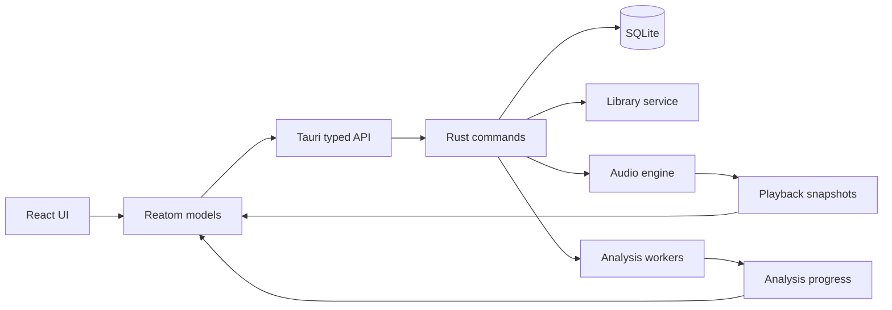

# Resonance

Local-first desktop music player and audio analyzer built with Tauri 2, React 19, TypeScript, Reatom v1001 and Rust. Audio files stay in their original folders; the app stores canonical paths, metadata, playlists, playback state and analysis caches locally.

## Stack

- Bun + Vite + React + strict TypeScript
- Feature-Sliced Design, checked by Steiger
- Reatom v1001 as the only state manager
- shadcn-style components over Radix UI primitives
- Tauri commands/events and typed frontend IPC
- Rust, SQLx + SQLite, Symphonia, Rubato and CPAL
- Canvas 2D waveform, peak map and draggable real-time frequency spectrum

## Prerequisites

Follow the [official Tauri prerequisites](https://tauri.app/start/prerequisites/). On Windows install Microsoft C++ Build Tools with **Desktop development with C++**, WebView2 and the stable MSVC Rust toolchain. Android additionally requires Android Studio, JDK, SDK/NDK and the documented environment variables.

```powershell
winget install --id Rustlang.Rustup
rustup default stable-msvc
```

Restart the terminal after installing Rust, then verify `rustc --version` and `cargo --version`.

## Development

```powershell
bun install
bun run tauri dev
```

Android initialization and development:

```powershell
bun run tauri android init
bun run tauri android dev
```

Quality gates (the build is intentionally separate):

```powershell
bun run typecheck
bun run lint
bun run lint:fsd
bun run test
bun run check:rust
```

## Architecture

Frontend follows `app → pages → widgets → features → entities → shared`. Slices expose public APIs through `index.ts`; UI never calls Tauri `invoke` directly. Reatom v1001 uses small domain atoms and actions. Frequent playback snapshots are isolated in the player feature instead of refreshing the entire application at animation-frame frequency.



Rust owns persistence, file validation, decoding, playback and analysis. `AppState` contains the SQLx pool, persistent queue and `AudioEngine`. The engine keeps filesystem and decoding work away from the CPAL callback and sends PCM through a lock-free queue.


## Local data

Tauri's application data directory contains:

```text
<AppData>/com.akustik.music-player/
├── library.sqlite
├── logs/
└── cache/
    ├── waveforms/
    ├── peaks/
    └── analysis/
```

SQLx migrations create library roots, tracks, playlists, playlist items, history, settings, analysis and equalizer tables. Imported music is never copied into AppData. Re-import uses canonical path plus size/mtime and a bounded BLAKE3 fingerprint. Background missing-file checks update `is_missing` without blocking initial rendering.

## Audio and analysis

Supported import and decode formats are MP3, FLAC and WAV. Playback uses a Symphonia decoder worker, a stateful Rubato FFT resampler, bounded lock-free PCM buffer and CPAL output stream. Playback is prebuffered before CPAL starts consuming PCM, and an underrun returns the engine to buffering instead of advancing through injected silence. Volume is smoothed in the real-time callback; seek restarts decoding from an accurate timestamp.

Offline analysis calculates 100 ms min/max waveform buckets, peak dBFS, RMS, crest factor and clipping counts, then saves a versioned JSON cache. The player can expand this cache into a seekable SoundCloud-style timeline. A separate draggable window renders a 48-band logarithmic FFT spectrum from the PCM currently reaching the audio output. Canvas views render at device pixel ratio. The current loudness value is an RMS-derived estimate rather than a certified EBU R128 measurement.

## Current limitations

- Embedded tag/cover extraction is not implemented yet; filename is used as the initial title.
- Queue reorder and playlist reorder are supported by transactional backend commands, but drag-and-drop UI is not wired yet.
- EQ database schema is present, but no fake controls are shown: the real biquad DSP chain and preset commands remain to be implemented.
- Android audio/device behavior has not been validated.
