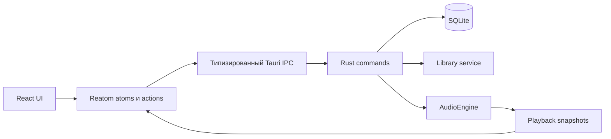
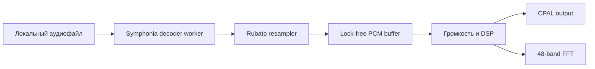

# Resonance

> [!IMPORTANT]
> Проект полностью спроектирован и собран с помощью искусственного интеллекта — OpenAI Codex. Код, архитектура, интерфейс и документация создавались ИИ по пользовательским требованиям и проходили автоматические проверки.

Resonance — локальный настольный музыкальный плеер на Tauri 2. Музыка не загружается в облако и не копируется внутрь приложения: файлы остаются в исходных папках, а Resonance локально хранит пути, метаданные, плейлисты, пользовательские метки, очередь и состояние воспроизведения.

## Что уже работает

### Медиатека

- импорт отдельных файлов или целой папки;
- форматы MP3, FLAC и WAV;
- локальное хранение метаданных в SQLite;
- поиск по названию, исполнителю, альбому и пользовательским меткам;
- избранные и недавно прослушанные треки;
- обнаружение перемещённых или удалённых файлов;
- открытие расположения файла в проводнике;
- удаление трека только из медиатеки без физического удаления файла.

### Плейлисты

- создание, переименование, закрепление и удаление плейлистов;
- красивые диалоги вместо системных `prompt`;
- добавление трека сразу в несколько плейлистов;
- защита от повторного добавления одного трека в один плейлист;
- удаление треков из плейлиста без удаления из медиатеки;
- серверные команды для изменения порядка треков.

### Пользовательские метки

К каждому треку можно прикрепить короткие цветные пометки, например «ночной вайб», «для дороги» или «доделать».

- до 24 Unicode-символов;
- семь цветов;
- защита от одинаковых меток у одного трека без учёта регистра;
- быстрое добавление и удаление прямо в таблице;
- сохранение в SQLite между запусками приложения;
- участие меток в поиске по медиатеке.

### Воспроизведение

- нативный аудиодвижок на Rust без браузерного `<audio>`;
- воспроизведение, пауза, переход к следующему и предыдущему треку;
- точная перемотка, громкость, повтор и случайный порядок;
- автоматический переход после окончания трека;
- repeat-one перезапускает текущий трек, repeat-all замыкает очередь;
- shuffle проходит цикл без мгновенных повторов и хранит историю для кнопки «Назад»;
- пропавшие файлы автоматически пропускаются при переходе;
- постоянная очередь воспроизведения с синхронным текущим индексом;
- восстановление громкости, repeat и shuffle после перезапуска;
- заполнение раздела «Недавние» и счётчика прослушиваний;
- предварительное заполнение аудиобуфера;
- защита от проигрывания тишины при опустошении буфера;
- плавное изменение громкости.

### Визуализация

- раскрываемый SoundCloud-подобный waveform-таймлайн с перемоткой;
- 48-полосный логарифмический спектр текущего аудиосигнала;
- свободно перемещаемое окно спектра в пределах приложения;
- Canvas 2D с учётом плотности пикселей экрана.

Отдельной страницы «Анализ» нет: визуализации находятся рядом с управлением плеером и открываются только тогда, когда нужны.

### Эквалайзер

- нативная 10-полосная обработка от 31 Гц до 16 кГц;
- диапазон каждой полосы от −12 до +12 дБ;
- отдельное предусиление для защиты от цифрового перегруза;
- плавное включение и bypass без остановки трека;
- базовые пресеты: без изменений, глубокий бас, яркость, вокал, рок, электроника и акустика;
- сохранение и удаление пользовательских пресетов;
- восстановление выбранной настройки после перезапуска.

### Цветовые темы

- шесть встроенных палитр: пять тёмных и одна светлая;
- пользовательские темы из четырёх опорных цветов: фон, поверхность, акцент и текст;
- автоматический расчёт вторичных поверхностей, границ, приглушённого текста, hover-состояний и контрастного текста на акценте;
- живой предпросмотр всей программы во время редактирования;
- сохранение до 20 пользовательских тем в SQLite и восстановление активной темы при запуске;
- единая система семантических CSS custom properties для страниц, таблиц, меню, поповеров, плеера и визуализаторов.

## Технологии

### Frontend

- Bun, Vite, React 19 и strict TypeScript;
- TanStack Router;
- Reatom v1001 как единственный менеджер состояния;
- Feature-Sliced Design, проверяемый Steiger;
- Radix UI и локальные shadcn-подобные компоненты;
- Canvas 2D для waveform и спектра;
- семантические CSS custom properties для встроенных и пользовательских цветовых тем;
- типизированный IPC поверх Tauri commands и events.

### Backend

- Rust и Tauri 2;
- SQLx и SQLite;
- Symphonia для декодирования MP3, FLAC и WAV;
- Rubato для stateful-ресемплинга;
- CPAL для вывода звука на системное аудиоустройство;
- RustFFT для спектрального анализа;
- bounded lock-free очереди для передачи PCM;
- BLAKE3 для идентификации содержимого файлов.

## Требования

Сначала установите [официальные prerequisites Tauri](https://tauri.app/start/prerequisites/).

Для Windows нужны:

- Microsoft C++ Build Tools с workload **Desktop development with C++**;
- WebView2 Runtime;
- Rust с toolchain `stable-msvc`;
- Bun.

```powershell
winget install --id Rustlang.Rustup
rustup default stable-msvc
rustc --version
cargo --version
bun --version
```

После установки Rust перезапустите терминал.

## Запуск для разработки

Все команды выполняются из корня репозитория:

```powershell
cd C:\Users\Akustik\WebstormProjects\the-best-player-music-of-the-worl
bun install
bun run tauri dev
```

Первая Rust-компиляция может занять заметное время. Если проект был физически перенесён в другую папку и Cargo сообщает пути из старого расположения, очистите только генерируемый кэш:

```powershell
cargo clean --manifest-path src-tauri/Cargo.toml
```

### Android

```powershell
bun run tauri android init
bun run tauri android dev
```

Android-сборка требует Android Studio, JDK, Android SDK/NDK и переменных окружения из документации Tauri. Работа нативного аудиодвижка на Android пока не подтверждена.

## Проверки

Frontend:

```powershell
bun run typecheck
bun run lint
bun run lint:fsd
bun run test
```

Rust:

```powershell
bun run check:rust
```

Все проверки сразу:

```powershell
bun run check
```

Команда `bun run build` намеренно не входит в обычный цикл проверок.

## Архитектура

Frontend следует слоям Feature-Sliced Design:

```text
src/
├── app/
├── pages/
├── widgets/
├── features/
├── entities/
└── shared/
```

Слои зависят только от нижележащих слоёв и используют публичные API через `index.ts`. React-компоненты не вызывают `invoke` напрямую: UI обращается к Reatom actions, те используют типизированный API сущности, а IPC-команда передаёт работу Rust.



Нативный аудиотракт:



Rust отвечает за файловую систему, проверку входных данных, SQLite, декодирование, очередь и воспроизведение. Частые snapshots плеера изолированы от остального состояния интерфейса, чтобы не перерисовывать всё приложение с частотой аудиообновлений.

## Локальные данные

Данные приложения хранятся в системной директории Tauri:

```text
<AppData>/com.akustik.music-player/
├── library.sqlite
├── logs/
└── cache/
    ├── waveforms/
    ├── peaks/
    └── analysis/
```

SQLx-миграции создают таблицы медиатеки, корневых папок, плейлистов, элементов плейлистов, истории, очереди, настроек, анализа, эквалайзера и пользовательских меток. Музыкальные файлы в эту директорию не копируются.

Повторный импорт сверяет канонический путь, размер, время изменения и ограниченный BLAKE3 fingerprint. Фоновая проверка отсутствующих файлов обновляет `isMissing`, не блокируя начальную загрузку интерфейса.

## Аудиодвижок и анализ

Декодирование выполняется отдельным worker-потоком. После декодирования аудио проходит stateful-ресемплинг и попадает в ограниченный PCM-буфер, откуда CPAL callback забирает данные для системного устройства. Callback не обращается к диску и не выполняет тяжёлые операции.

Offline-анализ формирует 100-миллисекундные min/max-точки waveform, peak dBFS, RMS, crest factor и число clipping samples. Результат хранится в версионированном JSON-кэше. Текущий показатель громкости является оценкой на основе RMS, а не сертифицированным измерением EBU R128.

## Текущие ограничения

- Извлечение встроенных ID3/Vorbis-метаданных и обложек ещё не реализовано; начальное название берётся из имени файла.
- Backend поддерживает изменение порядка очереди и плейлиста, но drag-and-drop интерфейс ещё не подключён.
- Нативный аудиодвижок и поведение аудиоустройств на Android не протестированы.
- Автоматические тесты покрывают базовые frontend-сценарии, но полноценного end-to-end набора пока нет.
